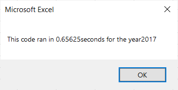

# Green Stock: To Nest or NOT To Nest

During Module 2 we helped Steve figure how profitable it would be for his parents to invest in DQ stock, this was one they wanted to put their money into. Steve gathered more information about other green stock to make compare his parents choice to similar companies in the market and how profitable they were. 

Using Visual Basic for Application (VBA) we were able to make a code that reported back on DQ performance in 2018. The code used a single loop that went through DQ stock information and concluded it wouldn't be the best choice for investment. We then moved to reviewing the performance of "All Stock" and found better options for investment to recommend to Steve's parents. Continuing to use VBA, we programmed the data to gather all the info for one stock and find the average return. Then do it again with the next stock and so on, using nesting loops we were able to receive these results. 

The Challenge consists of Steve wanting to review all the stock faster, in order to move this formula to larger sets of data, with faster results. 

## Results: How did you do this?

In refactoring the code that had been used to figure out the "All Stock Analysis," we were able to find a faster way to get the same answer. In searching for the performances of the "All Stock Analysis" nested loops were used. These took a little longer in that the loop starts in identifying the stock index and then reviewing it's performance, a nest within a loop.  The Challenge was to make the configuration go faster, by removing the nested loop we asked the code to review each indivdual line and find the efficiency using the tickerIndex. The time it took to return these results using the new method was noticeable: 

#### Time results for 2017

##### Using the All Stock code 

##### Reconfiguring All Stock Analysis

 ## Summary
' What are the the advantages and disadvantages of refactoring the code?
The information derived from the data using either the nested loop or the refactoring was the same, which is a good thing. The advantage of the refactoring was that we received the results much quicker because it went throught the data one time. The nested loop is programmed to comb through the data a few times picking up different things that are requested in the code. At this time I'm not sure what the disadvantages are. In a larger data set would it work the same way? It would probably need to be refactored to meet the needs of the new data. Also, with evaluating other data we would need to find a way to update certain parts of this refactoring, like the indexTickers. An equation that would read the indexes and update the array section. etc... many other ways to refactor this data as different needs proposed. 

